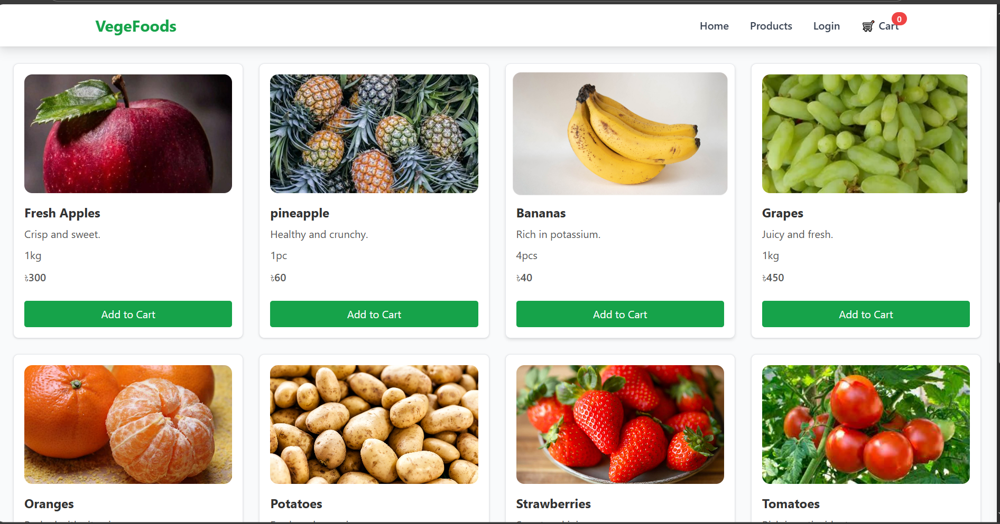
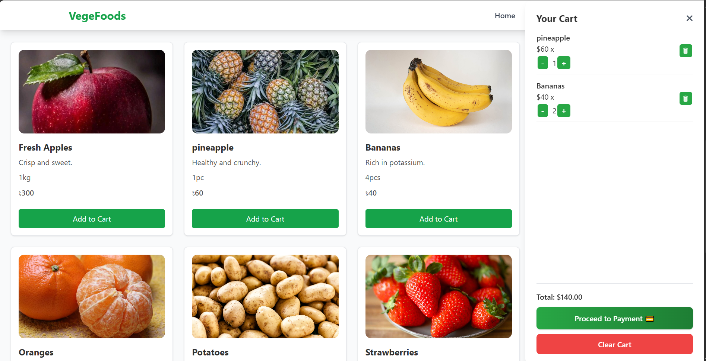
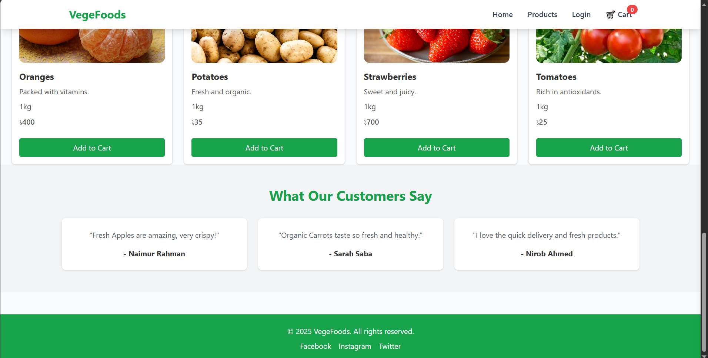

# VegeFoods - Online Shopping Cart Project

A modern and responsive **Shopping Cart Website** for fruits and vegetables built using **HTML, Tailwind CSS, and JavaScript**. This project allows users to browse products, add items to the cart, adjust quantities, and view the total price in a stylish sidebar.

---

## 🛒 Features

- **Product Listing**: Display fruits and vegetables with image, description, unit, and price.
- **Add to Cart**: Add products to a cart with a single click.
- **Quantity Controls**: Increment or decrement product quantity directly in the cart.
- **Cart Sidebar**: Slide-in sidebar to view items in the cart, total amount, and manage items.
- **Clear Cart**: Remove all items from the cart with one click.
- **Responsive Design**: Fully responsive layout for mobile, tablet, and desktop.
- **Tailwind CSS**: Modern styling and hover effects.
- **Interactive Buttons**: Add-to-cart and quantity buttons with smooth animations.

---

## 📷 Screenshots

### Home Page

### Product List

### Shopping Cart

### Customer Reviews

